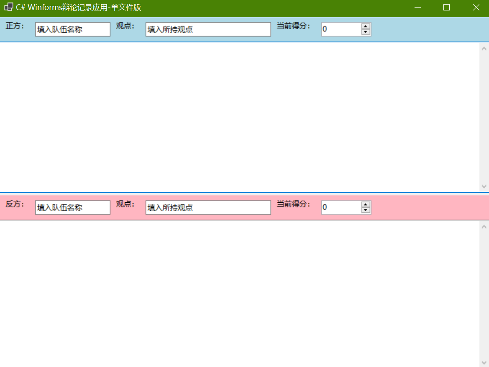

# 辩论记录应用（使用Python和C# WinForms）



一个简单的辩论记录应用，提供Python Tkinter和C# WinForms两种版本实现，用于实时记录正反双方的队伍名称、观点、得分和辩论内容。两者功能完全相同，记录辩论内容时建议分点记录。

## 功能特性

- 可填写正反双方队伍信息（队伍名称、所持观点）
- 得分记录范围为0-10分之间
- 多行文本记录辩论内容，建议分点记录
- 上下分栏布局，清晰展示双方信息

## 项目结构

```
├── App.cs          # C# WinForms 版本
├── app.py          # Python Tkinter 版本
├── LICENSE         # Apache License 2.0
├── NOTICE.md       # 版权声明文件
└── README.md       # 项目说明
```

## 安装并运行项目
首先使用Git克隆本项目仓库，或直接下载项目代码到本地，推荐使用[VS Code](https://code.visualstudio.com/)打开项目文件夹：
```bash
git clone https://github.com/Pac-Dessert1436/DebateRecorderApp-Python-CSharp.git
cd DebateRecorderApp-Python-CSharp
```

### Python版本

**所需环境**:
- [Python 3.11](https://www.python.org/downloads/)及以上版本
- Tkinter是Python的内置标准库，无需额外安装

**运行方法**:
```bash
python app.py
```

### C# 版本

**所需环境**:
- [.NET 10.0](https://dotnet.microsoft.com/download/dotnet/10.0)及以上版本

**运行方法**:
```bash
dotnet run App.cs
```

## 许可证

本项目采用Apache License 2.0许可证。详见[LICENSE](LICENSE)文件。